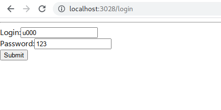

# Create a docker image (python3.9 + node 16)

```bash
cd docker_based/Dockerbuild_node16_python3.9/
docker build -t python3.9-nodejs16-buster:nikolaik-python3.9-nodejs16 --file Dockerfile_node_python_buster .
```

The above will create a docker image `python3.9-nodejs16-buster:nikolaik-python3.9-nodejs16`

# Create virtual env for django_main_server

```bash
cd DO_NOT_DELETE_CODING/django_main_server

# run docker container
hostfolder="$(pwd)"
dockerfolder="/home/simha/app"
docker run --rm -it \
  -v ${hostfolder}:${dockerfolder} \
python3.9-nodejs16-buster:nikolaik-python3.9-nodejs16 /bin/bash

# inside the docker container
# Create virtual env
simha@b612ce30792d:~/app$ pipenv shell
# install all packages
simha@b612ce30792d:~/app$ pipenv install --dev
```

# Create virtual env for flask_micro_service

```bash
cd DO_NOT_DELETE_CODING/flask_micro_service

# run docker container
hostfolder="$(pwd)"
dockerfolder="/home/simha/app"
docker run --rm -it \
  -v ${hostfolder}:${dockerfolder} \
python3.9-nodejs16-buster:nikolaik-python3.9-nodejs16 /bin/bash

# inside the docker container
# Create virtual env
simha@b612ce30792d:~/app$ pipenv shell
# install all packages
simha@b612ce30792d:~/app$ pipenv install --dev
```

# Create node env for frontend_reactjs

```bash
cd DO_NOT_DELETE_CODING/frontend_reactjs

# run docker container
hostfolder="$(pwd)"
dockerfolder="/home/simha/app"
docker run --rm -it \
  -v ${hostfolder}:${dockerfolder} \
python3.9-nodejs16-buster:nikolaik-python3.9-nodejs16 /bin/bash

# inside the docker container
# install node packages
simha@b612ce30792d:~/app$ npm install
```

# Run the docker compose

```bash
cd docker_based
docker-compose -p iqgateway -f docker-compose-localhost-localdb.yml up --build --force-recreate --remove-orphans
```

This will create the the postgresql database, and run the django, flask, celery, redis, jupyter, reactjs, phppgadmin etc containers

# Run migrations in django

## while docker compose is running do this

```bash
cd docker_based
docker-compose -p iqgateway -f docker-compose-localhost-localdb.yml  exec webapp /bin/bash

# in the the docker container
# make the migrations
simha@b612ce30792d:~/app$ pipenv shell
simha@b612ce30792d:~/app$ cd src
simha@b612ce30792d:~/app$ python manage.py migrate

# create sample user
simha@b612ce30792d:~/app$ python project_settings/create_sample_users.py
```

sample users u000, u001 etc with pass 123 are creates. Some can get data is `is_allowed_to_fetch=True` else not

# now check the url localhost:3028 (web UI in reactjs)

use:

```
login: u000
pass: 123
```



# Then you will see the the dashbord with "Get Data"

We are trying to get data csv data from table `links` of `gauranga` dbname hosted on `localhost`


# checking the latest csv file


# Dealing with users who are not allowed to fetch data


